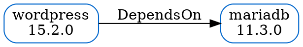

# helm-map Plugin — Architecture

> A Helm plugin that generates dependency graphs and resource maps for Helm charts and live releases.
> Compatible with both Helm v3 (binary/script model) and Helm v4 (WebAssembly/OCI model).

---

## Table of Contents

1. [Overview](#overview)
2. [Background & Problem Statement](#background--problem-statement)
3. [Ecosystem Gap Analysis](#ecosystem-gap-analysis)
4. [High-Level Architecture](#high-level-architecture)
5. [Plugin Entry Points](#plugin-entry-points)
   - [Helm v3 Plugin](#helm-v3-plugin)
   - [Helm v4 Plugin (WASM)](#helm-v4-plugin-wasm)
6. [Core Engine](#core-engine)
   - [Dependency Resolver](#dependency-resolver)
   - [Release Inspector](#release-inspector)
   - [Graph Builder](#graph-builder)
7. [Renderers](#renderers)
8. [Data Sources](#data-sources)
9. [Output Layer](#output-layer)
10. [Graph Data Model](#graph-data-model)
11. [JSON Schema (helm-map.com API)](#json-schema-helm-mapcom-api)
12. [CLI Reference](#cli-reference)
13. [Helm v3 vs Helm v4 — Comparison](#helm-v3-vs-helm-v4--comparison)
14. [Security Model](#security-model)
15. [Caching Strategy](#caching-strategy)
16. [Directory Structure](#directory-structure)
17. [Dependencies & Third-Party Libraries](#dependencies--third-party-libraries)
18. [Configuration](#configuration)

---

## Overview

`helm-map` is a Helm plugin that answers three questions developers constantly ask:

- **"What charts depend on what other charts, and to which version ranges?"**
- **"What Kubernetes resources does this release actually own?"**
- **"How do my charts and releases relate across namespaces or clusters?"**

It does this by parsing `Chart.yaml`, `Chart.lock`, and live Kubernetes release metadata, building an in-memory directed acyclic graph (DAG), and rendering it as a terminal tree, Graphviz DOT file, standalone SVG, or structured JSON.

The JSON output is designed to be consumed by the **helm-map.com** web frontend, enabling interactive topology browsing in a browser.

---

## Background & Problem Statement

Helm is the de facto Kubernetes package manager. As Helm adoption has grown, so has chart complexity:

- Charts routinely depend on 5–20 subcharts (e.g. a data platform chart pulling in PostgreSQL, Redis, Kafka, Prometheus, Grafana).
- Teams manage dozens of releases across multiple namespaces.
- CI/CD pipelines need machine-readable dependency information for drift detection, impact analysis, and upgrade planning.

**What exists today:**

| Tool | What it does | Gap |
|---|---|---|
| `helm dependency list` | Lists declared deps for one chart | No recursion, no graph, no resource mapping |
| `helm get manifest` | Shows rendered YAML for one release | No structure, no dep tree |
| `helm-mapkubeapis` | Fixes deprecated K8s APIs in release metadata | Completely different problem domain |
| `helm-chartmap` (Java) | Generates PlantUML dep reports | Not a Helm plugin, requires Java + Graphviz, no live release support |

**The gap:** No first-class Helm plugin exists that combines chart dependency resolution, live release resource ownership, and multi-format rendering into a single, installable `helm plugin install` command.

---

## Ecosystem Gap Analysis

Research finding: **helm-map.com** is a pre-launch or placeholder site returning only a bare HTML shell (`<title>Helm Map</title>`). No plugin, SDK, or tooling is published there as of April 2026.

The closest related projects:

- `github.com/helm/helm-mapkubeapis` — maps deprecated Kubernetes API versions in release secrets/configmaps. Solves migration, not visualization.
- `github.com/melahn/helm-chartmap` — Java-based, standalone (not a Helm plugin), generates PlantUML/JSON reports. No live cluster support.
- `helm dependency list` — built-in Helm command, flat output only, no recursion.

**Conclusion:** The `helm-map` plugin described in this document fills an unoccupied niche in the Helm ecosystem.

---

## High-Level Architecture

```
┌─────────────────────────────────────────────────────────────┐
│                        User / CLI                           │
│   helm map [release|chart|deps|live]  --output [format]    │
└────────────────────────┬────────────────────────────────────┘
                         │
          ┌──────────────┴──────────────┐
          │                             │
┌─────────▼──────────┐       ┌──────────▼──────────┐
│  Helm v3 Plugin    │       │  Helm v4 Plugin      │
│  plugin.yaml       │       │  WASM via Extism     │
│  Go binary         │       │  OCI-distributed     │
│  HELM_* env vars   │       │  Host function API   │
└─────────┬──────────┘       └──────────┬───────────┘
          └──────────────┬──────────────┘
                         │
┌────────────────────────▼────────────────────────────────────┐
│                     Core Engine (Go)                        │
│                                                             │
│  ┌──────────────────┐  ┌──────────────┐  ┌──────────────┐  │
│  │ DependencyResolver│  │ReleaseInspect│  │ GraphBuilder │  │
│  │ Chart.yaml walk  │  │ manifest/    │  │ DAG model    │  │
│  │ lock resolution  │  │ values/k8s   │  │ node + edge  │  │
│  └──────────────────┘  └──────────────┘  └──────────────┘  │
│                                                             │
│  ┌──────────────────┐  ┌──────────────┐  ┌──────────────┐  │
│  │ DotRenderer      │  │ JSONRenderer │  │TerminalRend. │  │
│  │ SVGRenderer      │  │ schema v1    │  │ ANSI tree    │  │
│  └──────────────────┘  └──────────────┘  └──────────────┘  │
└─────────────────────────────┬───────────────────────────────┘
                              │
         ┌────────────────────┼────────────────────┐
         │                    │                    │
┌────────▼───────┐  ┌─────────▼──────┐  ┌─────────▼──────┐
│  Local charts  │  │ Kubernetes API  │  │ OCI / Repo     │
│  Chart.yaml    │  │ release secrets │  │ chart index    │
│  values, tmpl  │  │ live resources  │  │ version meta   │
└────────────────┘  └────────────────┘  └────────────────┘
                              │
         ┌────────────────────┼────────────────────┐
         │                    │                    │
┌────────▼───────┐  ┌─────────▼──────┐  ┌─────────▼──────┐
│ Terminal tree  │  │  SVG / DOT     │  │  JSON output   │
│ stdout, CI     │  │  browser/viz   │  │  helm-map.com  │
└────────────────┘  └────────────────┘  └────────────────┘
```

---

## Plugin Entry Points

### Helm v3 Plugin

Helm v3 plugins are installed via `helm plugin install` and invoked as `helm <plugin-name> [args]`. They are external binaries or scripts declared in a `plugin.yaml` manifest.

**`plugin.yaml`:**

```yaml
name: "map"
version: "0.1.0"
usage: "Visualize Helm chart dependency and release resource maps"
description: |-
  helm-map generates dependency graphs for charts and resource maps
  for live releases. Output formats: terminal tree, DOT, SVG, JSON.
command: "$HELM_PLUGIN_DIR/bin/helm-map"
hooks:
  install: "scripts/install.sh"
  update: "scripts/install.sh"
ignoreFlags: false
platformCommand:
  - os: windows
    arch: amd64
    command: "$HELM_PLUGIN_DIR/bin/helm-map.exe"
  - os: linux
    arch: amd64
    command: "$HELM_PLUGIN_DIR/bin/helm-map"
  - os: darwin
    arch: arm64
    command: "$HELM_PLUGIN_DIR/bin/helm-map"
```

**Install script (`scripts/install.sh`):**

```bash
#!/usr/bin/env bash
set -e

PLUGIN_VERSION="0.1.0"
OS=$(uname -s | tr '[:upper:]' '[:lower:]')
ARCH=$(uname -m)
[ "$ARCH" = "x86_64" ] && ARCH="amd64"
[ "$ARCH" = "aarch64" ] && ARCH="arm64"

URL="https://github.com/your-org/helm-map/releases/download/v${PLUGIN_VERSION}/helm-map_${OS}_${ARCH}.tar.gz"
mkdir -p "$HELM_PLUGIN_DIR/bin"
curl -sSL "$URL" | tar -xz -C "$HELM_PLUGIN_DIR/bin"
chmod +x "$HELM_PLUGIN_DIR/bin/helm-map"
```

**Environment variables consumed from Helm v3:**

| Variable | Purpose |
|---|---|
| `HELM_NAMESPACE` | Scope release queries to this namespace |
| `HELM_KUBECONTEXT` | Kubernetes context to use |
| `HELM_DATA_HOME` | Base directory for plugin data storage |
| `HELM_CACHE_HOME` | Directory for caching pulled charts |
| `HELM_PLUGINS` | Directory where this plugin is installed |
| `HELM_BIN` | Path to the Helm binary (used for SDK calls) |
| `KUBECONFIG` | Forwarded transparently to Kubernetes client |

**Installation:**

```bash
helm plugin install https://github.com/your-org/helm-map
```

---

### Helm v4 Plugin (WASM)

Helm v4 introduced a redesigned plugin system based on WebAssembly (WASM) via the Extism runtime. Plugins can optionally be compiled to WASM for sandboxed, platform-agnostic execution. They are distributed as OCI artifacts.

Three plugin types exist in Helm v4:
- **CLI plugins** — behave like v3 plugins, receive CLI input, write to stdout
- **Getter plugins** — used when fetching charts via custom URI schemes
- **Post-renderer plugins** — process rendered YAML templates before deployment

`helm-map` implements the **CLI plugin** type in v4.

**`plugin.yaml` (v4 extended):**

```yaml
name: "map"
version: "0.2.0"
helmVersion: ">=4.0.0"
usage: "Visualize Helm chart dependency and release resource maps"
description: |-
  helm-map generates dependency graphs for charts and resource maps
  for live releases. Output formats: terminal tree, DOT, SVG, JSON.

# Helm v4: WASM module published to OCI
wasm:
  oci: "ghcr.io/your-org/helm-map-wasm:0.2.0"
  digest: "sha256:abc123..."   # pinned digest for reproducibility
  type: "cli"

# Fallback for environments without WASM runtime (or Helm v3)
fallback:
  command: "$HELM_PLUGIN_DIR/bin/helm-map"
  hooks:
    install: "scripts/install.sh"
```

**WASM entrypoint (Go + Extism PDK):**

```go
package main

import (
    "github.com/extism/go-pdk"
    "github.com/your-org/helm-map/internal/engine"
    "github.com/your-org/helm-map/internal/renderer"
)

//export map_run
func mapRun() int32 {
    args := pdk.GetArgs()
    cfg, err := engine.ParseArgs(args)
    if err != nil {
        pdk.SetError(err)
        return 1
    }

    graph, err := engine.Build(cfg, hostFunctions())
    if err != nil {
        pdk.SetError(err)
        return 1
    }

    out, err := renderer.Render(graph, cfg.OutputFormat)
    if err != nil {
        pdk.SetError(err)
        return 1
    }

    pdk.OutputString(out)
    return 0
}

// hostFunctions wraps Helm v4 host function calls exposed to the WASM sandbox.
func hostFunctions() engine.HostFunctions {
    return engine.HostFunctions{
        GetManifest:  helmGetManifest,
        GetValues:    helmGetValues,
        ListReleases: helmListReleases,
        DepList:      helmDepList,
        KubeGet:      kubeGet,
    }
}

func main() {}
```

**Host functions exposed by Helm v4 to the WASM sandbox:**

| Function | Signature | Description |
|---|---|---|
| `helm_get_manifest` | `(release, namespace) → yaml` | Get rendered manifest for a release |
| `helm_get_values` | `(release, namespace) → yaml` | Get merged values for a release |
| `helm_list` | `(namespace) → []ReleaseInfo` | List all releases in a namespace |
| `helm_dep_list` | `(chart_path) → []DepInfo` | Resolve chart dependencies |
| `kube_get` | `(apiVersion, kind, ns) → []Object` | Fetch live Kubernetes resources |

**OCI publishing:**

```bash
# Build WASM binary
tinygo build -o helm-map.wasm -target wasm ./cmd/wasm/

# Publish to OCI registry
oras push ghcr.io/your-org/helm-map-wasm:0.2.0 \
  helm-map.wasm:application/vnd.helm.plugin.wasm

# Sign with cosign
cosign sign ghcr.io/your-org/helm-map-wasm:0.2.0
```

**Installation in Helm v4:**

```bash
helm plugin install oci://ghcr.io/your-org/helm-map:0.2.0
```

---

## Core Engine

The core engine is a pure Go library (`internal/engine`) shared by both the v3 binary and the v4 WASM module. It has no dependency on the Helm CLI binary — it uses the Helm Go SDK directly.

### Dependency Resolver

**Package:** `internal/engine/resolver`

Recursively walks a chart's dependency tree starting from `Chart.yaml`. For each dependency:

1. Reads the `dependencies` block from `Chart.yaml` (Helm v3/v4 format) or `requirements.yaml` (legacy Helm v2 charts, read-only support)
2. Checks `Chart.lock` for pinned versions; falls back to version constraint resolution against the repository index
3. Recursively resolves subcharts in the `charts/` directory
4. Respects `condition` and `tags` fields to mark optional/conditional edges
5. Handles `repository: "file://..."` local chart dependencies

```go
package resolver

type ResolveConfig struct {
    ChartPath    string
    MaxDepth     int
    IncludeOptional bool
    RegistryAuth RegistryAuthConfig
}

type ResolvedDep struct {
    Name       string
    Version    string
    Repository string
    Condition  string   // e.g. "redis.enabled"
    Tags       []string
    Children   []ResolvedDep
}

func Resolve(cfg ResolveConfig) ([]ResolvedDep, error)
```

**Version resolution order:**

1. `Chart.lock` pinned version (if lock exists and is up-to-date)
2. Semantic version constraint matching against repository index (`index.yaml`)
3. OCI registry tag listing (for `repository: "oci://..."` deps)
4. Local filesystem chart in `charts/` subdirectory

### Release Inspector

**Package:** `internal/engine/inspector`

Given a release name and namespace, interrogates the Kubernetes cluster to extract:

- **Release metadata** — name, namespace, chart name + version, revision, status, deploy timestamp
- **Rendered manifest** — parsed Kubernetes objects (GVK, name, namespace, labels, annotations)
- **Values** — merged values (chart defaults + user overrides)
- **Resource ownership** — which resources are owned/managed by the release (via `helm.sh/chart` and `app.kubernetes.io/managed-by` labels)
- **Images** — container image references extracted from Pod specs in Deployments, StatefulSets, DaemonSets, Jobs

```go
package inspector

type InspectConfig struct {
    ReleaseName string
    Namespace   string
    KubeContext string
    Kubeconfig  string
    WithImages  bool
}

type InspectedRelease struct {
    Name       string
    Namespace  string
    ChartName  string
    ChartVersion string
    Revision   int
    Status     string
    Resources  []K8sResource
    Values     map[string]any
}

type K8sResource struct {
    APIVersion string
    Kind       string
    Name       string
    Namespace  string
    Labels     map[string]string
    Images     []string  // populated when WithImages=true
}

func Inspect(cfg InspectConfig, hf HostFunctions) (*InspectedRelease, error)
```

### Graph Builder

**Package:** `internal/engine/graph`

Merges the outputs of `resolver.Resolve` and `inspector.Inspect` into a unified in-memory graph.

```go
package graph

type NodeKind string

const (
    NodeChart       NodeKind = "Chart"
    NodeRelease     NodeKind = "Release"
    NodeK8sResource NodeKind = "K8sResource"
    NodeImage       NodeKind = "Image"
)

type Node struct {
    ID          string            // unique stable ID (e.g. "chart:bitnami/redis:18.1.0")
    Kind        NodeKind
    Name        string
    Version     string
    Repository  string
    Namespace   string
    Labels      map[string]string
    Annotations map[string]string
    Optional    bool              // dependency with condition/tag
    Condition   string            // .Values path that enables this dep
}

type EdgeKind string

const (
    EdgeDependsOn  EdgeKind = "DependsOn"   // chart → subchart
    EdgeOwns       EdgeKind = "Owns"         // release → k8s resource
    EdgeDeployedAs EdgeKind = "DeployedAs"  // chart → release
    EdgeUses       EdgeKind = "Uses"         // resource → image
)

type Edge struct {
    From      string
    To        string
    Rel       EdgeKind
    Condition string   // optional — populated from dep condition/tag
    Tags      []string
}

type Graph struct {
    Nodes []Node
    Edges []Edge
    Meta  GraphMeta
}

type GraphMeta struct {
    GeneratedAt    time.Time
    HelmVersion    string
    KubeContext    string
    PluginVersion  string
}

func Build(deps []resolver.ResolvedDep, releases []inspector.InspectedRelease) *Graph
func (g *Graph) Roots() []Node         // nodes with no incoming DependsOn edges
func (g *Graph) Children(id string) []Node
func (g *Graph) MaxDepth() int
func (g *Graph) TopoSort() []Node      // Kahn's algorithm, stable order
```

---

## Renderers

All renderers implement a common interface:

```go
package renderer

type Renderer interface {
    Render(g *graph.Graph) ([]byte, error)
}

type Format string

const (
    FormatTerminal Format = "terminal"
    FormatDOT      Format = "dot"
    FormatSVG      Format = "svg"
    FormatJSON     Format = "json"
)

func New(f Format, opts Options) Renderer
```

### TerminalRenderer

Renders an ANSI-coloured tree to stdout. Uses `charmbracelet/lipgloss` for styling and `charmbracelet/bubbles/tree` for the tree widget (or a custom implementation for non-TTY environments).

- Chart nodes: cyan
- Release nodes: green
- K8s resource nodes: yellow, grouped by kind
- Optional/conditional deps: dimmed with `[condition]` annotation
- Images: magenta (only shown with `--with-images`)

Example output:
```
wordpress-release (Release, default)
├── wordpress (Chart 15.2.0, bitnami)
│   ├── mariadb (Chart 11.3.0, bitnami)   [mariadb.enabled]
│   └── memcached (Chart 6.6.0, bitnami)  [memcached.enabled]
├── Deployment/wordpress
├── Service/wordpress
├── ConfigMap/wordpress-config
└── PersistentVolumeClaim/wordpress-data
```

### DotRenderer

Emits Graphviz DOT language. Compatible with `dot`, `neato`, `fdp`, and other Graphviz layout engines.



Pipe to Graphviz for SVG:
```bash
helm map chart ./wordpress --output dot | dot -Tsvg -o map.svg
```

### SVGRenderer

Generates a self-contained SVG with no external dependencies. Implements a simple force-directed layout in Go using a Fruchterman-Reingold algorithm. Nodes are clickable — clicking a node opens `helm-map.com/node/{id}` in a browser. Embeds CSS for light/dark mode adaptation.

### JSONRenderer

Emits a structured JSON document matching the `helm-map.com` API schema (see below). Suitable for piping to `helm map push` or for machine consumption in CI pipelines.

---

## Data Sources

### Local charts

Read directly from the filesystem. Supports:
- Unpacked chart directories (`Chart.yaml` + `templates/` + `charts/`)
- Packaged chart tarballs (`.tgz`) — extracted in-memory using Helm's loader
- Symlinked subcharts

### Kubernetes API

Accessed via the Helm Go SDK's action configuration, which respects `KUBECONFIG` and `--kube-context`. Uses `helm.sh/helm/v3/pkg/action` and `k8s.io/client-go` — no subprocess calls to `kubectl`.

In Helm v4 WASM mode, Kubernetes access is mediated through host functions exposed by the Helm runtime, so the WASM sandbox never directly opens a network socket.

### OCI / Repository Index

Remote charts are resolved by fetching the repository `index.yaml` (for HTTP repositories) or listing OCI tags (for `oci://` repositories). The Helm SDK handles authentication via `~/.config/helm/registry/config.json` (for OCI) and `~/.config/helm/repositories.yaml`.

---

## Output Layer

| Format | Invocation | Use case |
|---|---|---|
| Terminal tree | `--output terminal` (default) | Developer inspection, CI log output |
| DOT file | `--output dot` | Pipe to Graphviz for custom rendering |
| SVG file | `--output svg` | Self-contained browser-viewable graph |
| JSON | `--output json` | Machine consumption, helm-map.com API |

---

## Graph Data Model

The canonical in-memory model is the `graph.Graph` struct (see Core Engine → Graph Builder above). The key design choices:

- **Nodes are globally unique by ID** — IDs are namespaced strings: `chart:name:version`, `release:namespace/name`, `k8s:namespace/Kind/name`, `image:registry/name:tag`
- **Edges carry semantic type** — `DependsOn`, `Owns`, `DeployedAs`, `Uses` — so renderers can filter or style them differently
- **Optional dependencies are first-class** — edges carry the `Condition` string so the renderer can show/hide conditional paths
- **Graph is immutable after Build** — all mutation happens in the resolver/inspector; the graph is a read-only value passed to renderers

---

## JSON Schema (helm-map.com API)

```json
{
  "$schema": "https://helm-map.com/schema/graph/v1.json",
  "version": "1",
  "meta": {
    "generatedAt": "2026-04-11T10:00:00Z",
    "helmVersion": "3.14.0",
    "pluginVersion": "0.1.0",
    "kubeContext": "my-cluster"
  },
  "nodes": [
    {
      "id": "chart:bitnami/wordpress:15.2.0",
      "kind": "Chart",
      "name": "wordpress",
      "version": "15.2.0",
      "repository": "https://charts.bitnami.com/bitnami",
      "namespace": null,
      "optional": false,
      "condition": null,
      "labels": {},
      "annotations": {}
    },
    {
      "id": "release:default/my-wordpress",
      "kind": "Release",
      "name": "my-wordpress",
      "version": "15.2.0",
      "repository": null,
      "namespace": "default",
      "optional": false,
      "condition": null,
      "labels": {},
      "annotations": {}
    },
    {
      "id": "k8s:default/Deployment/my-wordpress",
      "kind": "K8sResource",
      "name": "my-wordpress",
      "version": null,
      "repository": null,
      "namespace": "default",
      "optional": false,
      "condition": null,
      "labels": {
        "app.kubernetes.io/managed-by": "Helm",
        "helm.sh/chart": "wordpress-15.2.0"
      },
      "annotations": {}
    }
  ],
  "edges": [
    {
      "from": "chart:bitnami/wordpress:15.2.0",
      "to": "chart:bitnami/mariadb:11.3.0",
      "rel": "DependsOn",
      "condition": "mariadb.enabled",
      "tags": ["database"]
    },
    {
      "from": "release:default/my-wordpress",
      "to": "k8s:default/Deployment/my-wordpress",
      "rel": "Owns",
      "condition": null,
      "tags": []
    },
    {
      "from": "chart:bitnami/wordpress:15.2.0",
      "to": "release:default/my-wordpress",
      "rel": "DeployedAs",
      "condition": null,
      "tags": []
    }
  ]
}
```

---

## CLI Reference

```
helm map — visualize Helm chart dependency and release resource maps

Usage:
  helm map <command> [flags]

Commands:
  chart    <path|repo/name>     Dependency graph of a chart (local or remote)
  release  <release-name>       Resource map of a live release
  deps     <path|repo/name>     Flat dependency list with resolved versions
  live     [--namespace <ns>]   Map of all releases in a namespace
  push     [--url <endpoint>]   Push JSON graph to helm-map.com API
  version                       Print plugin version

Global flags:
  --output, -o    terminal|dot|svg|json    Output format (default: terminal)
  --depth         int                      Max dependency depth (default: 0 = unlimited)
  --with-images                            Include container images in the graph
  --dry-run                                Resolve deps without hitting cluster
  --kubeconfig    string                   Override kubeconfig path
  --kube-context  string                   Override Kubernetes context
  --namespace, -n string                   Override namespace (default: from HELM_NAMESPACE)

Examples:
  helm map chart ./my-chart
  helm map chart bitnami/wordpress --output dot | dot -Tsvg -o out.svg
  helm map release my-wordpress --output json | helm map push
  helm map live --namespace production --output svg > prod.svg
  helm map deps ./platform-chart --depth 3
```

---

## Helm v3 vs Helm v4 — Comparison

| Concern | Helm v3 | Helm v4 |
|---|---|---|
| Plugin entrypoint | Go binary + `plugin.yaml` | WASM module via Extism + OCI artifact |
| Distribution | GitHub Releases tarball | OCI registry (`ghcr.io/…`) |
| Install command | `helm plugin install https://github.com/…` | `helm plugin install oci://ghcr.io/…` |
| Platform support | Pre-compiled per OS/arch | Single WASM binary, runs anywhere |
| Cluster access | `KUBECONFIG` env + client-go SDK | Sandboxed host function calls |
| Filesystem access | Direct via Go `os` package | Host function mediated (sandboxed) |
| Post-renderer support | Separate `--post-renderer` binary | First-class plugin type |
| Plugin verification | SHA256 checksum in install script | OCI digest, signed with cosign |
| Security model | Process isolation only | WASM sandbox + OCI provenance |
| Chart caching | `HELM_CACHE_HOME` path | Content-addressed hash cache (Helm v4) |
| Backwards compatibility | N/A | Falls back to v3 binary if WASM runtime absent |
| Required Go toolchain | `go build` standard | `tinygo` + Extism Go PDK for WASM target |
| Environment variable passing | All `HELM_*` vars passed automatically | Via host function interface |

---

## Security Model

### Helm v3

- Plugin binary runs as the user's OS process with full filesystem and network access
- Kubernetes access is via the user's `KUBECONFIG` — no privilege escalation
- Plugin code is trusted by the user on installation (same as any CLI tool)
- Install script downloads a binary from GitHub Releases — SHA256 checksums published alongside each release; verified in `install.sh`
- Code signing via GitHub's artifact attestation (`gh attestation`)

### Helm v4

- Plugin runs inside an Extism WASM sandbox — no direct filesystem or network access
- All I/O goes through typed host functions exposed by the Helm runtime
- Plugin installed by digest — `sha256:...` pinned in `plugin.yaml`, Helm v4 verifies before execution
- Image signing via cosign — OCI artifact signature verified on install
- Supply chain: reproducible WASM builds via TinyGo with pinned dependency checksums (`go.sum`)

---

## Caching Strategy

### Chart metadata cache

Remote chart index files (`index.yaml`) and chart tarballs are cached under `$HELM_CACHE_HOME/helm-map/` using a content-addressed naming scheme:

```
$HELM_CACHE_HOME/helm-map/repos/<hash-of-repo-url>/index.yaml
$HELM_CACHE_HOME/helm-map/charts/<hash-of-chart-ref>.tgz
```

Cache TTL is configurable via `--cache-ttl` (default: 10 minutes for index files, indefinite for chart tarballs since they are immutable by version).

### Kubernetes resource cache

Live Kubernetes resource data (release secrets, resource lists) is never cached — always fetched fresh to ensure the graph reflects actual cluster state.

### Resolved graph cache

An optional `--cache-graph` flag writes the resolved `graph.Graph` as a JSON file to `$HELM_DATA_HOME/helm-map/cache/<release-or-chart-hash>.json`. Useful in CI when the same chart is mapped multiple times in a pipeline.

---

## Directory Structure

```
helm-map/
├── cmd/
│   ├── helm-map/          # v3 binary entrypoint
│   │   └── main.go
│   └── wasm/              # v4 WASM entrypoint
│       └── main.go
├── internal/
│   ├── engine/
│   │   ├── resolver/      # DependencyResolver
│   │   │   ├── resolver.go
│   │   │   └── resolver_test.go
│   │   ├── inspector/     # ReleaseInspector
│   │   │   ├── inspector.go
│   │   │   └── inspector_test.go
│   │   └── graph/         # GraphBuilder + data model
│   │       ├── graph.go
│   │       ├── build.go
│   │       └── graph_test.go
│   ├── renderer/
│   │   ├── terminal.go
│   │   ├── dot.go
│   │   ├── svg.go
│   │   ├── json.go
│   │   └── renderer_test.go
│   ├── cache/
│   │   └── cache.go
│   └── config/
│       └── config.go      # CLI flag parsing + env var binding
├── pkg/
│   └── schema/
│       └── v1/            # Public JSON schema types (importable by helm-map.com)
│           └── types.go
├── scripts/
│   ├── install.sh
│   └── verify.sh
├── plugin.yaml
├── go.mod
├── go.sum
├── Makefile
├── Dockerfile             # For CI/CD build environment
├── ARCHITECTURE.md
├── TODO.md
└── README.md
```

---

## Dependencies & Third-Party Libraries

| Library | Purpose | Version |
|---|---|---|
| `helm.sh/helm/v3` | Helm Go SDK — chart loading, release querying, repo management | v3.x |
| `k8s.io/client-go` | Kubernetes API client for resource discovery | v0.29.x |
| `github.com/extism/go-pdk` | Extism WASM Plugin Development Kit (v4 WASM only) | v1.x |
| `github.com/charmbracelet/lipgloss` | ANSI terminal styling for TerminalRenderer | v0.x |
| `github.com/spf13/cobra` | CLI command/flag parsing | v1.x |
| `github.com/spf13/viper` | Configuration file + env var binding | v1.x |
| `github.com/stretchr/testify` | Test assertions | v1.x |
| `go.uber.org/zap` | Structured logging | v1.x |
| `oras.land/oras-go/v2` | OCI artifact push/pull for WASM distribution | v2.x |

**Build tools:**

| Tool | Purpose |
|---|---|
| `tinygo` | Compile Go to WASM (smaller binary than standard Go WASM) |
| `cosign` | OCI artifact signing for Helm v4 plugin distribution |
| `oras` | OCI artifact push for WASM module |
| `goreleaser` | Cross-platform binary building and GitHub Release publishing |

---

## Configuration

`helm-map` reads configuration from (in priority order, highest first):

1. CLI flags (`--output`, `--depth`, etc.)
2. Environment variables (`HELM_MAP_OUTPUT`, `HELM_MAP_DEPTH`, etc.)
3. Config file: `$HELM_DATA_HOME/helm-map/config.yaml`
4. Built-in defaults

**Example `config.yaml`:**

```yaml
output: terminal
depth: 0
withImages: false
cacheTTL: 10m
push:
  endpoint: https://api.helm-map.com/v1/graphs
  token: ""   # set via HELM_MAP_PUSH_TOKEN env var
```
