# helm-map

A Helm plugin that visualises chart dependency trees and release resource maps.

## Architecture



See [ARCHITECTURE.md](ARCHITECTURE.md) for full design details.

## Features

- **Chart dependency graph** — recursively resolve and display chart dependencies from `Chart.yaml` / `Chart.lock`
- **Multiple output formats** — terminal tree (ANSI coloured), JSON (machine-readable), DOT and SVG (coming soon)
- **Conditional dependencies** — shows `condition` and `tags` annotations on optional deps
- **Lock file support** — uses pinned versions from `Chart.lock` when available
- **Legacy support** — reads `requirements.yaml` for Helm v2 charts

## Installation

### Helm v3

```bash
helm plugin install https://github.com/senet/helm-map
```

### Helm v4

```bash
helm plugin install --verify=false https://github.com/senet/helm-map
```

> **Note:** Helm v4 enforces plugin signature verification by default. Once a signed
> release is published (with `.prov` files), `--verify=false` will no longer be needed.
> To verify manually, import the [public key](helm-map.pub) and check the `.prov` files
> attached to each GitHub Release.

### Build from source

```bash
git clone https://github.com/senet/helm-map.git
cd helm-map
make build
make install-local
```

## Compatibility

| Helm Version | Status | Notes |
|---|---|---|
| v3.18+ | Tested | Full support |
| v4.1+ | Tested | Requires `--verify=false` until signed releases are published |

## Usage

### Chart dependency tree

```bash
# Local chart
helm map chart ./my-chart

# With depth limit
helm map chart ./my-chart --depth 2

# JSON output
helm map chart ./my-chart --output json
```

### Flat dependency list

```bash
helm map deps ./my-chart
helm map deps ./my-chart --output json
```

### Version

```bash
helm map version
```

## Example Output

```
my-app (Chart 1.0.0)
├── backend (Chart 2.0.0)
│   └── postgresql (Chart 12.0.0)  [postgresql.enabled]
├── frontend (Chart 1.5.0)
└── redis (Chart 17.3.7)  [redis.enabled] [tags: cache]
```

## Commands

| Command | Description | Status |
|---------|-------------|--------|
| `chart` | Dependency graph of a chart | ✅ Available |
| `deps` | Flat dependency list | ✅ Available |
| `release` | Resource map of a live release | 🔜 Phase 2 |
| `live` | Map of all releases in a namespace | 🔜 Phase 2 |
| `push` | Push graph to helm-map.com API | 🔜 Phase 2 |
| `version` | Print plugin version | ✅ Available |

## Global Flags

| Flag | Description | Default |
|------|-------------|---------|
| `--output, -o` | Output format: terminal, json, dot, svg | terminal |
| `--depth` | Max dependency depth (0 = unlimited) | 0 |
| `--with-images` | Include container images in graph | false |
| `--dry-run` | Resolve deps without hitting cluster | false |
| `--namespace, -n` | Override namespace | from `HELM_NAMESPACE` |
| `--kubeconfig` | Override kubeconfig path | |
| `--kube-context` | Override Kubernetes context | |

## Configuration

helm-map reads configuration from (highest priority first):

1. CLI flags
2. Environment variables (`HELM_MAP_OUTPUT`, `HELM_MAP_DEPTH`, etc.)
3. Config file: `$HELM_DATA_HOME/helm-map/config.yaml`
4. Built-in defaults

## Development

```bash
# Build
make build

# Run tests
make test

# Lint
make lint

# Coverage report
make cover
```

## Release Signing

Releases are signed with GPG. Each `.tar.gz` archive has a corresponding `.prov` signature file.

To verify a release manually:

```bash
# Import the public key
gpg --import helm-map.pub

# Verify an archive
gpg --verify helm-map_linux_amd64.tar.gz.prov helm-map_linux_amd64.tar.gz
```

## License

Apache License 2.0 — see [LICENSE](LICENSE) for details.
